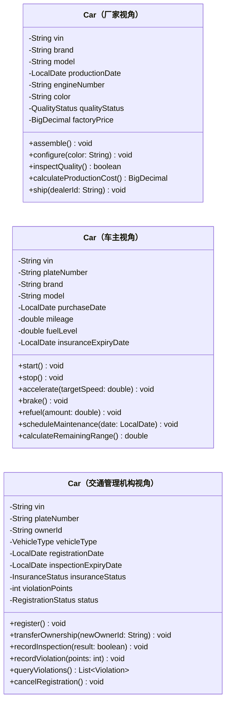

# 作业 2：汽车类的多角度 UML 建模

## 题目

分别从“厂家、车主、交通管理机构”三个角度，设计三个“汽车”类，并定义相关的属性和方法。

## 类图

## 设计说明

- **厂家视角**：关注车辆的唯一识别、生产配置、成本、质量状态和出厂流程。
- **车主视角**：关注驾驶操作、日常使用、能源余量、里程、保险和保养。
- **交通管理机构视角**：关注法定登记信息、所有权、年检、保险、违法记分和注销状态。

三个类是同一现实对象在不同业务边界中的抽象，并非继承关系，因此类图中不设置泛化箭头。三个类共享 `vin`，使不同业务系统可以识别同一车辆。

## 文件

- [`assignment2.puml`](assignment2.puml)：可编辑的 PlantUML 源文件。
- [`assignment2.svg`](assignment2.svg)：导出的 UML 类图，可直接预览。
- [`assignment2.png`](assignment2.png)：PNG 格式的 UML 类图，便于下载或插入文档。
